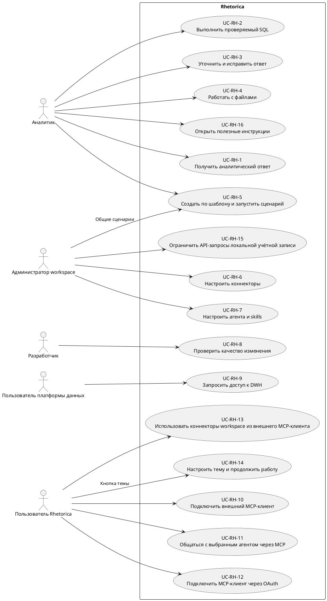

# Варианты использования

```plantuml
@startuml
left to right direction
actor "Аналитик" as Analyst
actor "Администратор workspace" as Admin
actor "Разработчик" as Developer
actor "Пользователь платформы данных" as DataUser
actor "Пользователь Rhetorica" as User

rectangle Rhetorica {
  usecase "UC-RH-1\nПолучить аналитический ответ" as UC1
  usecase "UC-RH-2\nВыполнить проверяемый SQL" as UC2
  usecase "UC-RH-3\nУточнить и исправить ответ" as UC3
  usecase "UC-RH-4\nРаботать с файлами" as UC4
  usecase "UC-RH-5\nСоздать по шаблону и запустить сценарий" as UC5
  usecase "UC-RH-6\nНастроить коннекторы" as UC6
  usecase "UC-RH-7\nНастроить агента и skills" as UC7
  usecase "UC-RH-8\nПроверить качество изменения" as UC8
  usecase "UC-RH-9\nЗапросить доступ к DWH" as UC9
  usecase "UC-RH-10\nПодключить внешний MCP-клиент" as UC10
  usecase "UC-RH-11\nОбщаться с выбранным агентом через MCP" as UC11
  usecase "UC-RH-12\nПодключить MCP-клиент через OAuth" as UC12
  usecase "UC-RH-13\nИспользовать коннекторы workspace из внешнего MCP-клиента" as UC13
  usecase "UC-RH-14\nНастроить тему и продолжить работу" as UC14
  usecase "UC-RH-15\nОграничить API-запросы локальной учётной записи" as UC15
  usecase "UC-RH-16\nОткрыть полезные инструкции" as UC16
}

Analyst --> UC1
Analyst --> UC2
Analyst --> UC3
Analyst --> UC4
Analyst --> UC5
Admin --> UC5 : Общие сценарии
Admin --> UC6
Admin --> UC7
Developer --> UC8
DataUser --> UC9
User --> UC10
User --> UC11
User --> UC12
User --> UC13
User --> UC14 : Кнопка темы
Admin --> UC15
Analyst --> UC16
@enduml
```


